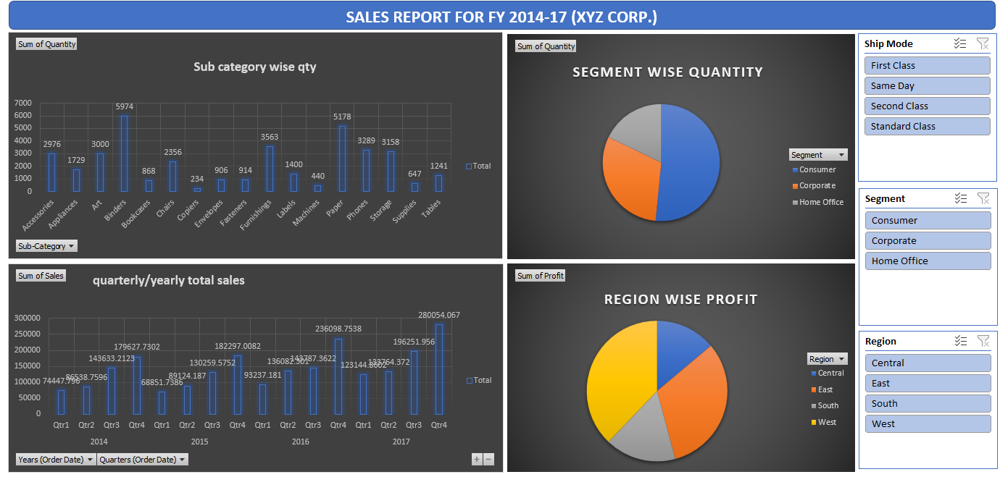
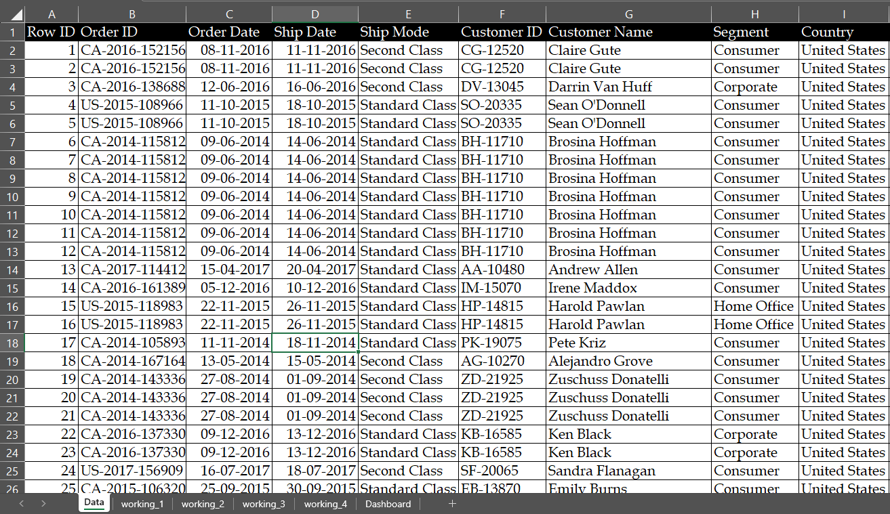
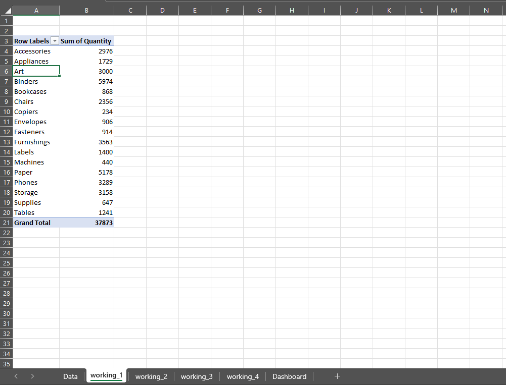
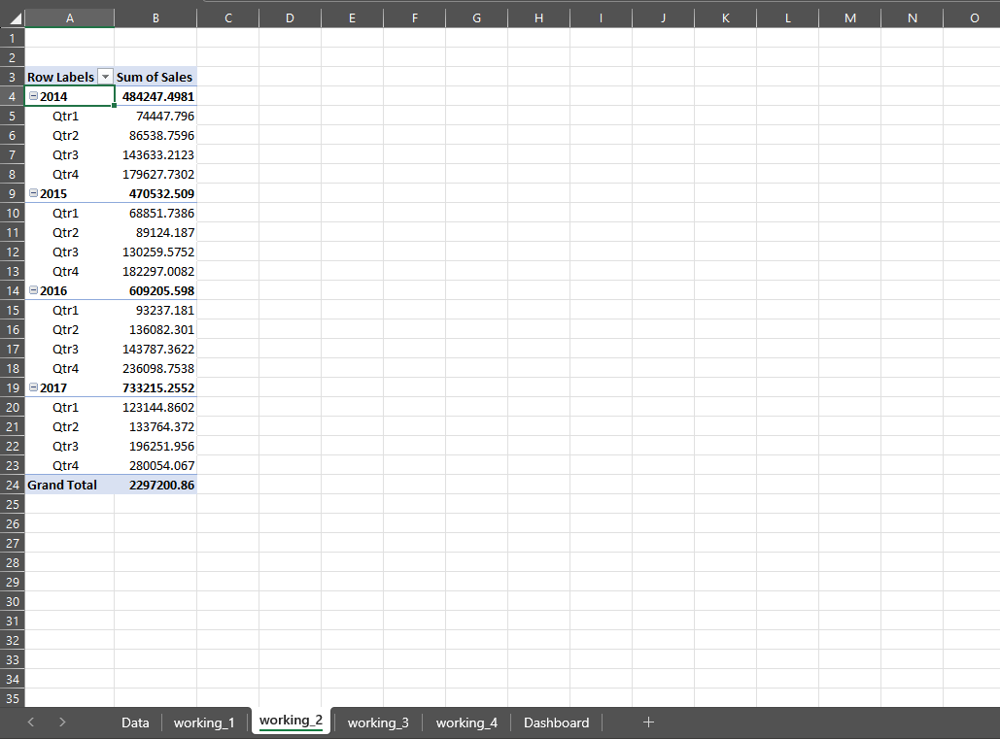
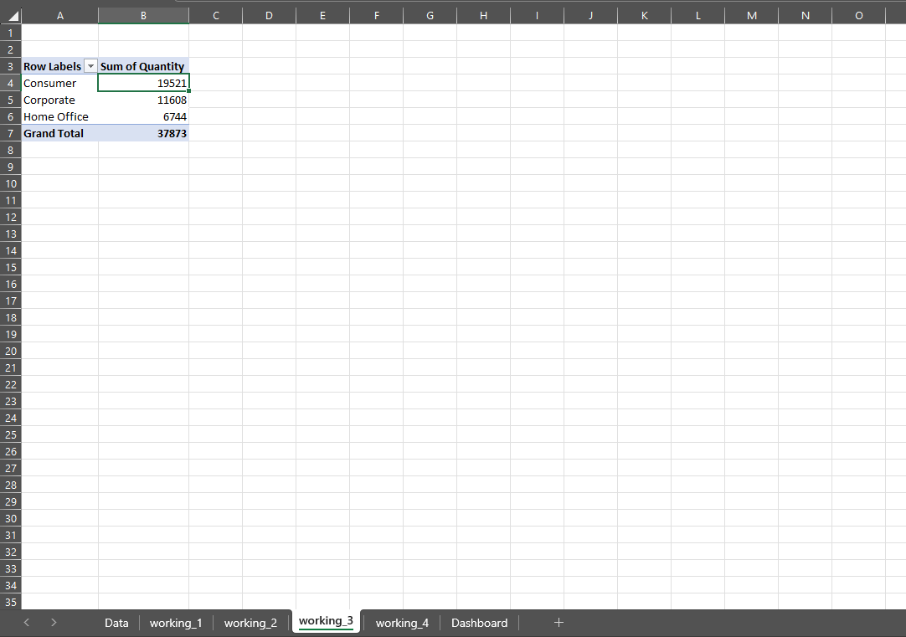
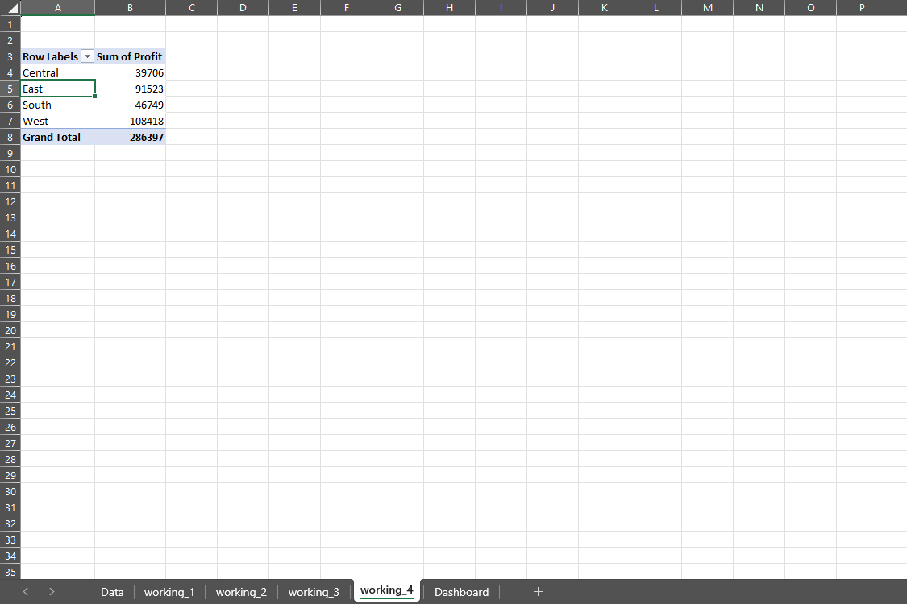

# 📊 Sales Report Dashboard | Excel

## 📌 Project Overview

This project presents an interactive **Sales Report Dashboard created in Microsoft Excel** using a dataset of **10,000 sales records**.

The dashboard is designed to analyze sales quantity, profit, and sales performance across different **sub-categories, segments, regions, quarters, and years**. Interactive **Slicers** are included to make the dashboard easy to filter and explore.

---

## 🛠️ Tools & Technologies Used

- **Microsoft Excel**
- Pivot Tables
- Pivot Charts
- Slicers
- Data Filtering & Analysis
- Excel Dashboard Design

---

## 📊 Dashboard Features

### 1. Sub-Category Wise Quantity

A column chart showing the total quantity sold across different product sub-categories.

### 2. Segment Wise Quantity

A pie chart showing quantity distribution across:
- Consumer
- Corporate
- Home Office

### 3. Quarterly / Yearly Total Sales

A column chart showing sales performance across different quarters and years from **2014 to 2017**.

### 4. Region Wise Profit

A pie chart showing profit distribution across:
- Central
- East
- South
- West

---

## 🎛️ Interactive Slicers

The dashboard includes three interactive slicers:

### Ship Mode
- First Class
- Same Day
- Second Class
- Standard Class

### Segment
- Consumer
- Corporate
- Home Office

### Region
- Central
- East
- South
- West

These slicers allow users to **filter the dashboard dynamically** and analyze specific parts of the sales data.

---

## 📸 Project Screenshots

### 📊 Dashboard

### 📁 Raw Data

### ⚙️ Working Process - 1

### ⚙️ Working Process - 2

### ⚙️ Working Process - 3

### ⚙️ Working Process - 4

---

## 🔄 Dashboard Workflow

1. Prepared the sales dataset.
2. Used **10,000 sales records** for analysis.
3. Created Pivot Tables to summarize the data.
4. Created Pivot Charts for visual analysis.
5. Added interactive Slicers for filtering.
6. Connected the Slicers with the dashboard visuals.
7. Organized the visuals into a single interactive dashboard.
8. Applied formatting and dashboard design for better readability.

---

## 📈 Key Analysis Areas

- Product sub-category wise quantity
- Segment-wise quantity distribution
- Quarterly and yearly sales performance
- Region-wise profit distribution
- Sales performance based on shipping mode
- Customer segment analysis
- Regional performance

---

## 🎯 Project Objective

The main objective of this project is to transform raw sales data into an **interactive and easy-to-understand Excel dashboard** that helps users quickly evaluate sales quantity, sales trends, customer segments, shipping modes, and regional profitability.

---

## 📂 Project Files

- `Dashboard using excel.xlsx` — Main Excel dashboard and analysis file
- `Dashboard.png` — Final dashboard screenshot
- `Data.png` — Dataset screenshot
- `Working_1.png` — Working process screenshot
- `Working_2.png` — Working process screenshot
- `Working_3.png` — Working process screenshot
- `Working_4.png` — Working process screenshot

---

## 👤 Project Created By

**Upendra Yadav**

### Skills Demonstrated

**Excel | Data Analysis | Pivot Tables | Pivot Charts | Slicers | Dashboard Development**
